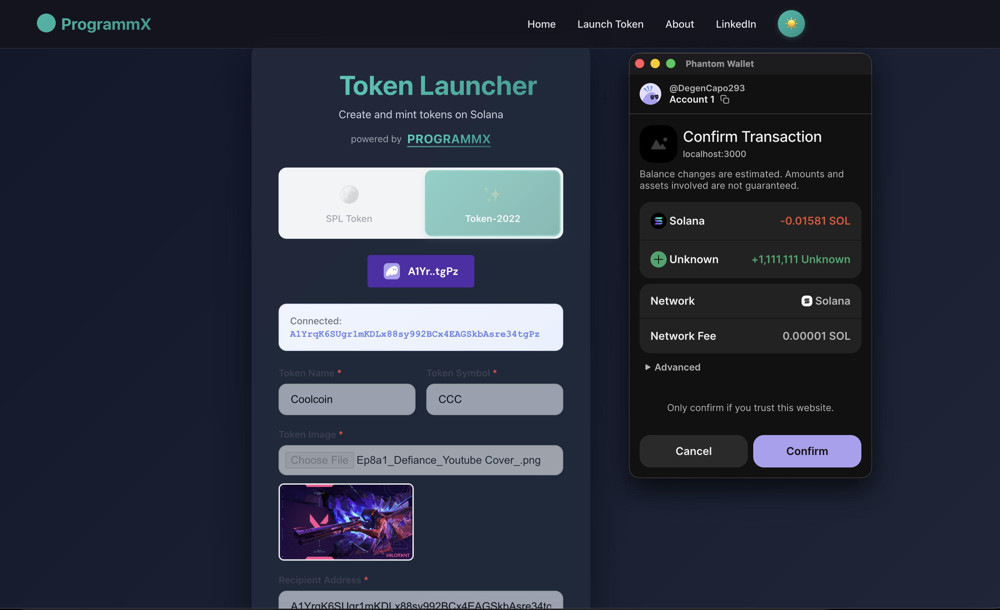
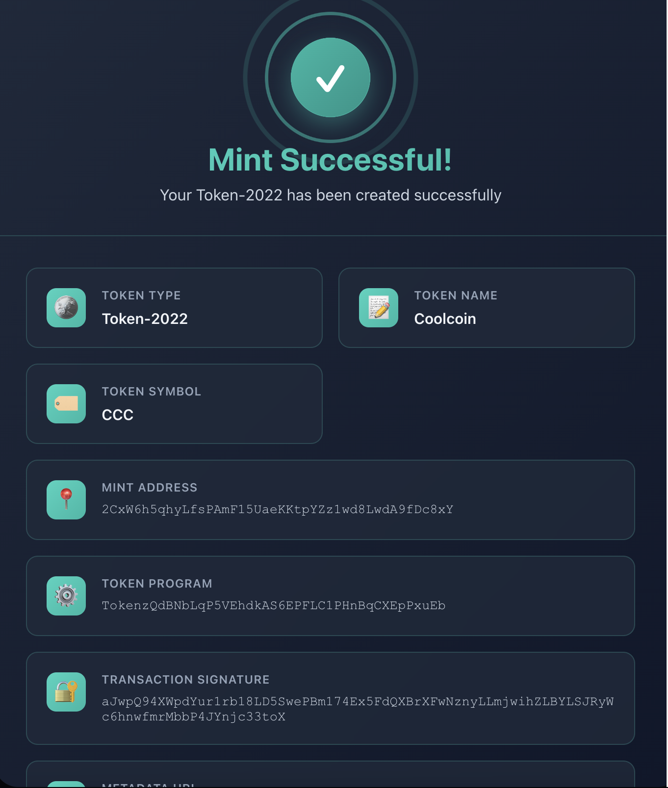

# SPL Token Minter - Setup Guide




## Backend Setup

1. Install backend dependencies:
```bash
npm install
```

2. Create a `.env` file in the root directory:
```
PRIVATE_KEY=your_base58_encoded_private_key
```

3. Start the backend server:
```bash
npm start
```

The backend will run on `http://localhost:3000`

## Frontend Setup

1. Navigate to the frontend directory:
```bash
cd frontend
```

2. Install frontend dependencies:
```bash
npm install
```

3. (Optional) Create a `.env` file in the frontend directory if you want to change the API URL:
```
REACT_APP_API_URL=http://localhost:3000
```

4. Start the frontend development server:
```bash
npm start
```

The frontend will open at `http://localhost:3000` (or the next available port)

## Usage

1. Make sure both backend and frontend servers are running
2. Open the frontend in your browser
3. Connect your Solana wallet (Phantom, Solflare, etc.)
4. Make sure your wallet is connected to **Devnet**
5. Fill in the form:
   - **Recipient Address**: The wallet address that will receive the tokens
   - **Amount**: The amount of tokens to mint (will be converted to supply)
   - **Decimals**: Number of decimals (e.g., 9 for SOL-like tokens, 6 for USDC-like tokens)
   - **Mint Authority Address** (Optional): Leave empty to use payer as mint authority
6. Click "Mint Tokens"
7. Approve the transaction in your wallet
8. Wait for confirmation

## Features

- 🎨 Beautiful gradient UI with smooth animations
- 🔐 Solana Wallet Adapter integration
- 🪙 Mint SPL tokens with custom parameters
- 📱 Fully responsive design
- ⚡ Real-time transaction status updates
- ✅ Transaction confirmation tracking

## Notes

- The app is configured for Solana **Devnet**
- Make sure your wallet is set to Devnet mode
- The backend creates the transaction and the frontend signs and sends it
- All transactions are partially signed by the backend (mint keypair) and fully signed by the frontend (payer wallet)

